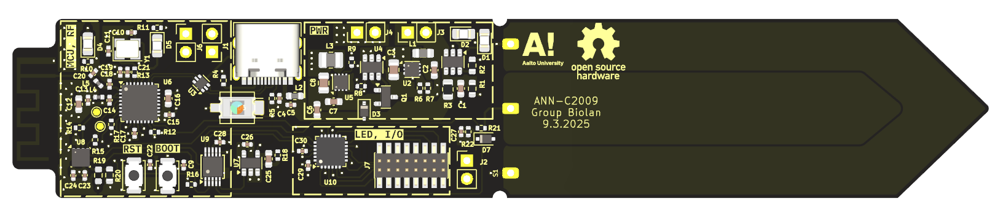

## Plant-health-meter
This repository contains Aalto AAN-C2009 project device hardware configuration and embedded software.

## PCB
PCB design done in KiCad.

## Embedded software
[esp programming guide](https://docs.espressif.com/projects/esp-idf/en/v5.2.5/esp32c3/get-started/index.html)
