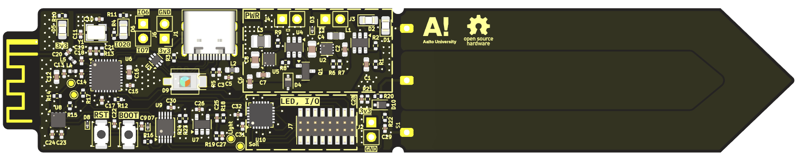
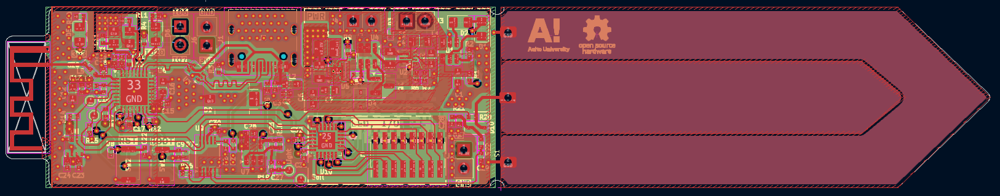

## Plant-health-meter
This repository contains Aalto AAN-C2009 project device hardware configuration and embedded software for a plant health monitoring system based on the ESP32c3 SoC.

## Features
- Soil moisture sensing
- Ambient light monitoring
- Temperature and humidity measurement
- Battery-powered operation with charging circuit
- LED indicators for plant status

## PCB
PCB design done in KiCad.

Schematic: [PDF](PCB/img/schematic.pdf)

## Hardware Components
- ESP32-C3 microcontroller
- BME280 temperature/humidity sensor
- Capacitive soil moisture sensor
- OPA340 light sensor amplifier
- ADS1115 16-bit ADC for accurate measurements

## Embedded software
Embedded software is written in C using the ESP-IDF Development Framework.
[esp programming guide](https://docs.espressif.com/projects/esp-idf/en/v5.2.5/esp32c3/get-started/index.html)

## Pin Assignments
See the schematic for detailed I/O connections and sensor bus configuration.

## Setup Instructions
1. Follow the ESP-IDF installation guide
2. Clone this repository
3. Build and flash using `idf.py build flash monitor`

## Power Requirements
3.7V Li-ion battery or USB power
